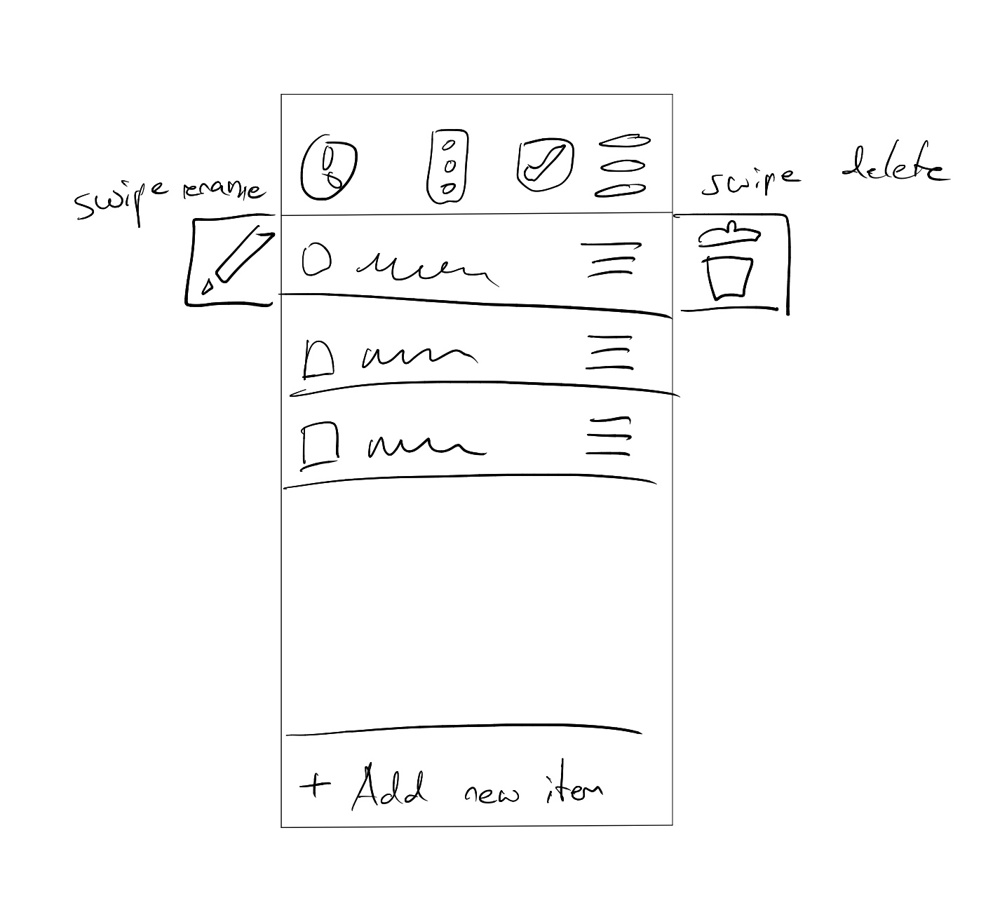
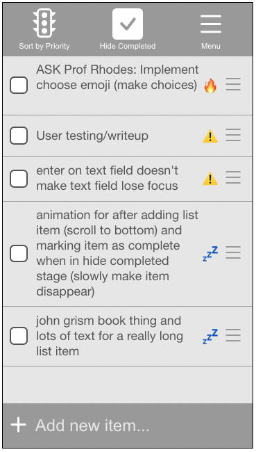
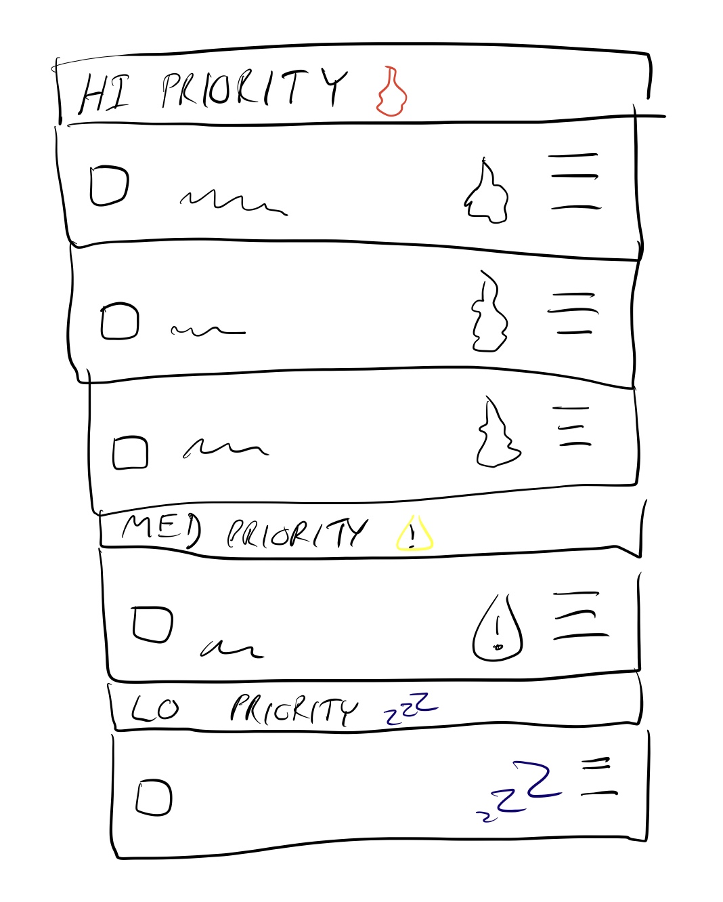
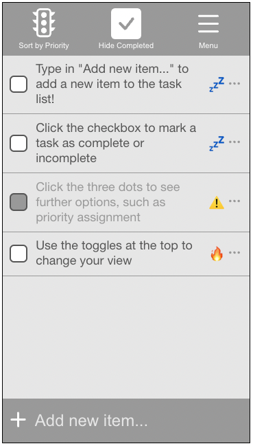
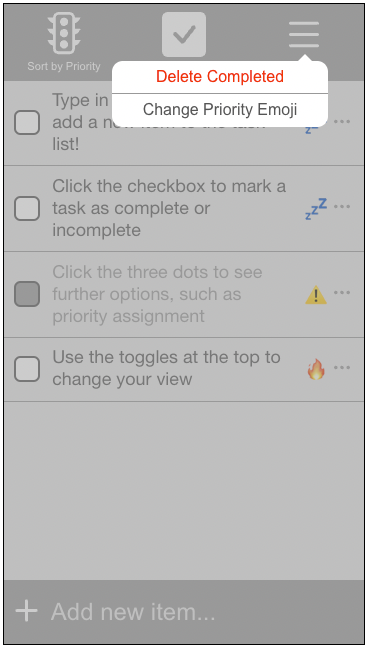
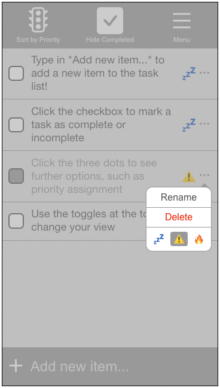

# Design Decisions

This document outlines the rationale behind our design decisions. It describes why elements are placed where they are, why certain elements appear a certain way, have certain properties and behavior, etc.

## Element Placement

On the top bar, we added toggle buttons that change how the tasks in the list are displayed. We have a toggle button for Sort by Priority, and a toggle button for Show/Hide Completed Tasks. We thought that these actions are actions a user may use often, so they are not hidden in the menu.

Deleting all tasks that are completed is a destructive action, so it would be bad if the user accidentally clicked this icon without knowing what it does. Thus, we placed this action under the menu icon in the upper right corner along with a text description. Additionally, it is not a common action, so it is okay for it to take more clicks to activate.

New items go at the bottom of the list because this is what happens when people add items to a physical (on paper) to-do list so we believe this is more intuitive.

We decided to place the "Add Task (+)" button on the bottom left hand corner of the screen because most people are right-handed. When holding a phone with just the right hand, the bottom-left corner is the most accesible with the right thumb. This should reduce the friction in using our to-do app. Additionally, this is an element that is likely to be used multiple times in quick succession, and it would be annoying for the user if it were to move with each usage, so it is pinned to the bottom of the app. This was a suggestion by Prof. Rhodes.

To edit a task, the user can click on the three dots icon, where they will also be able to edit other details of the task.
This icon is a common icon used to open up more options

## Task Element

Clicking on the task (everywhere except the menu) should mark the item as completed/not-completed because this is probably the most common action most users would want to do to this item.

Priority level adjustment, deleting the task, and renaming the task can be done from the task menu as we thought these are actions that are not commonly used, and can be hidden in the task menu to maximize the surface area for marking the task complete/incomplete.

We also considered making clicking on the priority level icon cycle through the possible priority levels for that task. We are currently still deciding between whether to do this or to just have clicking on the priority icon mark the task as completed/incomplete like clicking anywhere else.

The checkbox goes on the left of each task as that is where it is usually positioned on a physical to-do list. We included a checkbox because otherwise, it may not be immediately obvious how to mark an item as complete/incomplete. After checking an item, we grey out the text for that task. We considered putting a strikethrough on the text for completed tasks but we ended up deciding not to for readability.

We decided to have different emojis (🔥, ⚠️, 💤) for the different priority levels for people who are color blind. This was a suggestion from Prof. Rhodes. 

We made the 💤 the default priority level for tasks because if a user does not bother to change the priority level of a task, it is usually a safe assumption that it is unimportant.

## Button Behavior

Clicking the + button adds a new task item and puts the cursor in the add new item text field so that users to not have to click it again. We believe this should make it more convenient for users to add multiple tasks at once.

For renaming a task, after clicking the "rename" in the submenu, the text field becomes editable. In this mode, clicking the text for that specific task moves the text cursor as one would expect instead of toggling the checkbox like how our app usually behaves.

## Auto-Scrolling

We made the task list auto scroll to the bottom upon creation of a new task as we wanted to make it obvious to the user that a new task has been successfully added.

## Color Palette

We chose a very neutral grey color palette as our app will have a lot of color from the priority levels we can assign to each task and we do not want it to clash with the background and overall theme of the app.

#ffffff, #e6e6e6, #999999, #494949

## Swipe Quick Actions

This has not yet been implemented.

We also would like to implement a quick swipe action for each task item similar to how mail apps allow users to quick mark an email as unread or to quick delete a mail by swiping that mail left/right. 

We would like to implement quick swipe actions for quickly deleting the task and quickly renaming the task, respectively.

We think that adding swipe quick actions can only be beneficial as to users who are not aware of its functionality, it does not take away from the user experience and does not clutter up the UI. It is invisible if the user chooses not to use it. 

# Alternative Designs
Initially, we had 4 buttons on the top bar: A clock, a stoplight, a checkmark, and the menu icon. 3 of these icons made it to the final design but the clock was scrapped. Initially, the clock and the stoplight were for ordering the task items by creation date and by priority level, respectively, and they would form a radio button group. However, we decided that sorting items by creation date wasn't very meaningful so we decided to just leave in the priority level stoplight button but as a singular toggle button instead.

We also considered adding due date fields for each of the tasks, but we thought that might make the task too complicated and we were not sure how to display the information cleanly. This is still something we are looking into adding in the future.

We had the menu icons for each of the task items use the hamburger icon at first but many of the users we asked to test our app found the icon misleading as it is also sometimes used for movable (draggable) elements, so we changed it to the three dots icon instead.

When sorting by priority level, we also considered having dividers within the task list itself to divide the tasks of high, medium, and low priority into their own sections. We did not have time to implement this but we will experiment with this to see if it makes the user experience better.

### Dark Mode

We also would like to implement a dark mode to invert the colors. Since our theme is greyscale, this should be easy to do without breaking the aesthetic of our app. 

# User Testing

## Informal Testing
Initially, we wanted to not have labels associated with the menu icons on the top bar of our app, but from our user testing, none of the users we tested the product on were able to successfully guess what the icons represented or what their functionality was. Because of this, we decided to add labels to each of our icons on the top bar. 
## Testing Group 1: Holly Chen
From our testing with Holly, we found that the stock emojis we selected are not immediately obvious as priority levels to everyone. At this point, our select priority emoji option to allow users to set the emoji corresponding to each priority level has not been implemented yet, but we believe that this should solve this problem and Holly agreed.

Holly also found a bug in our program where the submenu popups would pop up out of view if they were too far down the page. We later fixed this bug by making the submenu popup appear on top of the button instead if the task item is too far down the page.

Holly also mentioned wanting the ability to drag to reorder tasks in the list. We are not sure whether we want to do this yet as this would conflict with our current model for task ordering, but it is something we may look into in the future.

We also found that it is not immediately obvious that a task has been sucessfully added if the task list is long. The user would have to scroll down to see that their new task has been successfully added to the task list. To fix this, we WILL AUTOSCROLL TO THE BOTTOM.

## Testing Group 2: Keo Chui and Cole Nagata
Keo mentioned that the sorting icon, especially the one for sorting by priority, is not clear. It is not clear whether the filled-in stoplight means sort by priority or not. Because of this, we decided to modify the description text for that icon.

Keo also thought that the task items could be reordered by dragging on the menu icon. This made us realize that the menu "hamburger" icon is actually quite misleading as it is sometimes used to indicate that something can be moved, so we decided to change the "hamburger" menu icon to a "three dots" menu icon for the submenu for each task item instead.
## Testing Group 3: Sydney Cornell and Ruby Foxall
Sydney and Ruby found the app fairly intuitive, and they were able to figure out how to use the app exactly as we intended. This showed us that many of the design decisions and iterations we have made eventually did lead to a fairly intuitive, easy-to-use product.
## Testing Group 4: Kaveh Pezeshki
Kaveh also found the app intuitive, but only after adding a couple of task items. This made us realize that the app would benefit from a "tutorial" of sorts. Because of this, we decided to add some default task items that are already in the task list explaining to users the different functionalities of the app. These default task items would show when the user launches the app for the first time.

## Testing Group 5: Zooey Meznarich and Amy Qian
Initially, Zooey was not able to figure out what the buttons at the top did since there were no tasks in the task item, so it seemed like they did nothing. This can be fixed by adding default list items. Amy also said the same thing Holly said earlier about how the hamburger icon is misleading, and that we should change it to the three dots icon instead. They also mentioned that the ability to change emojis for each priority level would be nice, and that swipe quick actions would be nice. We will implement the priority level emoji selector for this lab, and we will attempt to add swipe actions in a future release.

# Final Design

Below are screenshots of our final design for the app, along with the popup menus.

# Challenges We Faced

## Lab 1
We found the implementation of the following to be difficult/time consuming:
- Modifying the text entry box and its placeholder text
- Creating the popup box
- Creating arrows on popup boxes
- Styling the checkbox
- Making the middle section of the task list scrollable

By far the most difficult thing we tried to implement for this lab was the swipe action. We were unsure of how to accomplish this. Since this lab is mostly just for the design and it does not have to be functional yet, we decided to give up on this feature for now and we will try to implement it in future labs.

## Lab 2
We found the implementation of the following to be difficult/time consuming:
- Making the text field of a list item activate the checkbox and not editable through direct clicking
- Making the dropdown element appear on top/bottom depending on screen position
- Making an auto-resizing textarea field that is not editable

# Parts of the Design we are most proud of

We are especially proud of the emoji indicators for priority level, a well as the functionality to sort by the priority level of tasks. We thought that this would be a useful feature that we ourselves would like to see and use in a to-do list, so we decided to implement it.

We are also happy with the grey theme we went with as it is very neutral and it should mesh well with any of the priority level icon emojis, especially since we will allow users to change these emojis themselves if they would like to.